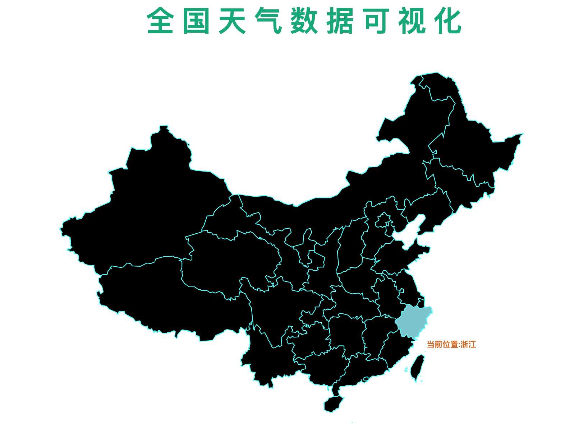
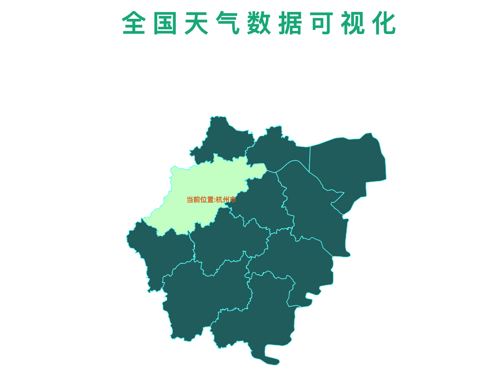
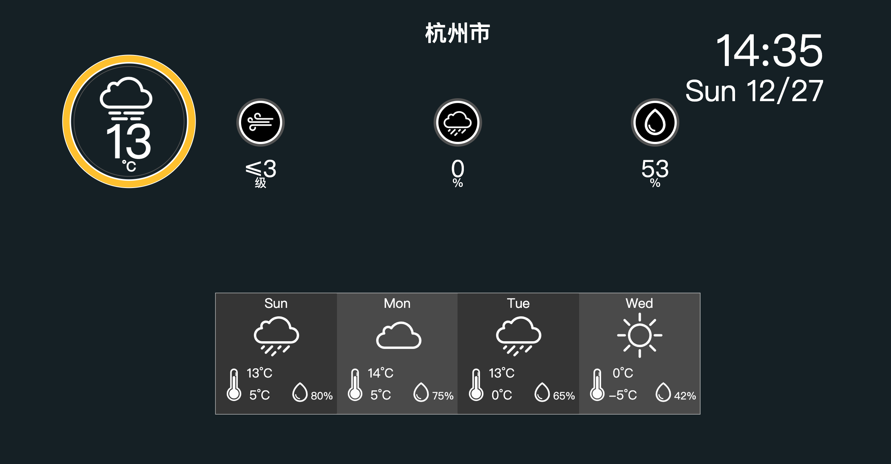

# 基于D3框架的中国天气数据可视化
> China Weather Data Visualization Based On D3 Framework

## Contents
* [Demo](#Demo)
* [Screenshots](#screenshots)
* [Setup](#setup)
* [Restful API](#Restful API)
* [Inspiration](#inspiration)
* [Contact](#contact)

## Demo

http://weather.leom.me

## Screenshots

## Setup
#### Globally via `npm`

    npm install --global http-server

This will install `http-server` globally so that it may be run from the command line anywhere.

#### Globally via Homebrew

    brew install http-server

#### Then

    cd [project path]
    http-server -c-l

## Restful API

https://github.com/myleo1/weather-server-go

## Inspiration

https://observablehq.com/@alanyu1216/weather-panel

## Contact
Created by [@myleo1](https://github.com/myleo1) - feel free to contact me!